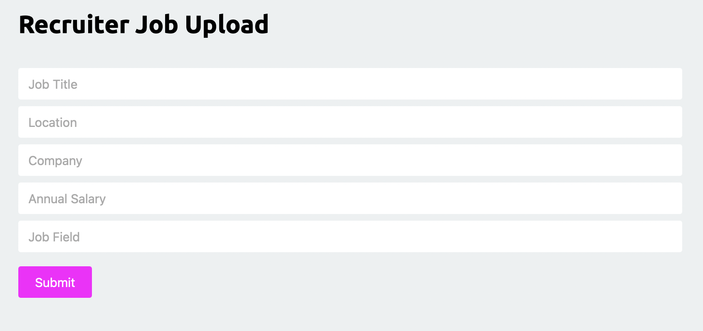

# Job Search Project
Now with [Docker](https://github.com/monotiller/engineering89-job-project-group-2/tree/docker) support

## Breifing
The breifing was to build on top of our previous and to include a data scraping tool that would scour a website (in this case [ITJobsWatch](https://www.itjobswatch.co.uk/)) and to show the top 50 job roles on the website.

## How to setup the website
### Docker
The easiest way to view the website would be through [Docker](https://hub.docker.com/r/monotiller/eng89_jcp)! Simply run `docker run monotiller/eng89_jcp` and navigate to http://127.0.0.1:5000/

### Manual setup
1. Clone the repository (or [download it as a zip](https://github.com/monotiller/engineering89-job-project-group-2/archive/refs/heads/main.zip) and extract)
2. Make sure Python 3.9.5 or above and the pip package manager is installed
3. Move into the folder that you put the project
4. Run `pip install requirements.txt` to install the required packages to run the site
5. Run `export FLASK_APP=main.py`
6. Run `flask run`
7. Head to http://127.0.0.1:5000/

## Features

The role page is capable of searching through and sorting all available roles that have been scraped, it's up to you on how you have the data displayed. Additionally we've added a method of restricting what data is displayed for non-logged out users, this is to enourage peolpe to be signed up to the website to gain full access!

Each role has an expanded page with more information on it. We thought that this would be a great way to compare roles against each other to better help inform your job hunting!

You can also search for roles too to find out more information about where you might like to work next!

Finally, if you'd like to add your own job posting, YOU CAN! Simply log in with a recruiter account and add away!